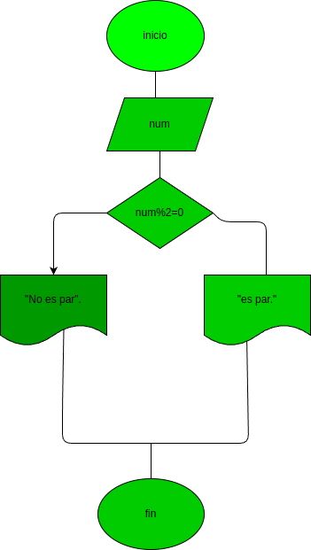

# Par_o_impar
programa para calcular si un numero es par o impar

# analisis

## input

variables de entrada:num:el numero que se probara si es par o impar

## processing
num%2=0 print("es par. ") else: print("no es par. ")

## output
es par / no es par

## diseño
 "diagrama de flujo"